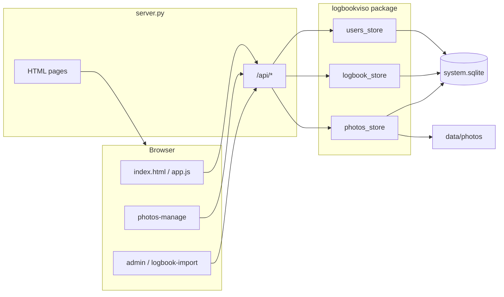

# Architektur – Logbook Viso

## Datenfluss

## Datenbank (`SYSTEM_DB`)

Eine SQLite-Datei enthält alle relationalen Daten:

| Tabelle | Inhalt |
|---------|--------|
| `users` | Benutzername, Passwort-Hash, Rolle |
| `user_toerns` | Welche Törn-IDs ein normaler User sehen darf |
| `toerns` | Metadaten importierter Törns (Name, Revier, Schiff) |
| `log_points` | Track-Punkte pro Törn (GPS, Status, Wetter, Freitext) |
| `photos` | Medien-Metadaten (Pfad relativ zu `PHOTOS_DIR`, GPS, Uploader) |

Medien-**Dateien** liegen unter `PHOTOS_DIR/<törn-id>/`. Die DB speichert nur Dateinamen.

## Logbook-Import

1. Admin lädt Viso-`logbook.sqlite` hoch → temporär unter `LOGBOOK_UPLOAD_DIR/<uuid>.sqlite`.
2. Preview listet Törns aus `Toernrecord` / `Logrecord`.
3. Import kopiert gewählte Törns + Punkte in `toerns` / `log_points` (bestehende IDs werden ersetzt).

## Berechtigungen

- **Nicht angemeldet:** nur `/login`, statische Assets.
- **User:** Törns aus `user_toerns`, Fotos lesen, eigene Fotos bearbeiten.
- **Admin:** alle Törns, Benutzerverwaltung, Logbook-Import, alle Fotos bearbeiten.

Session: Flask cookie, `user_id` in Session → `users_store.get_user_by_id`.

## Frontend-Seiten

| Pfad | Skripte |
|------|---------|
| `/` | auth.js, common.js, app.js, Leaflet |
| `/photos` | auth.js, common.js, photos-manage.js |
| `/admin` | auth.js, common.js, admin.js |
| `/admin/logbook` | auth.js, common.js, logbook-import.js |
| `/login` | login.js (ohne common.js) |

## Umgebungsvariablen

Siehe README-Tabelle. Zentrale Definition: `logbookviso/config.py` → `settings`.
